# Appendix A — Block Diagrams, Design & Event Flows

> **Belongs to:** `jobMonitorManagmentDesign.md`  
> **Design option implemented:** Option C — Job-Embedded Shard with Custody Manifest

---

## A.1 — Overall System Architecture

```
┌──────────────────────────────────────────────────────────────────────────────┐
│  FALCON MACHINE  (Windows 10 LTSC)                                            │
│                                                                               │
│  ┌──────────────┐  writes  ┌────────────────────────────────────────────┐    │
│  │   AOI_Main   │─────────>│  c:\job\                                   │    │
│  │   RMS        │          │    Diced_10.0.4511\                        │    │
│  │   Falcon.Net │          │      .audit\                               │    │
│  │   DataServer │          │        audit.db  ◄──────────────────────┐ │    │
│  └──────────────┘          │        manifest.json                    │ │    │
│                            │      S1\Recipes\R1\Recipe.ini           │ │    │
│  ┌─────────────────────────┴───────────────────────────────────────┬─┴─┘    │
│  │  FalconAuditService.exe  (single exe — Windows Service +        │        │
│  │                           Kestrel REST API :5100)               │        │
│  │                                                                 │        │
│  │  ┌── FILE MONITORING ──────────────────────────────────────┐   │        │
│  │  │ FileMonitorService   DirectoryWatcher   FileChangeHandler│   │        │
│  │  │ FSW c:\job\**        c:\job\ depth-1    classify·hash    │   │        │
│  │  │ debounce 500 ms      job arrive/depart  enqueue→queue    │   │        │
│  │  │ Channel<ChangeEvent> → N consumer tasks                  │   │        │
│  │  └─────────────────────────────────────────────────────────┘            │
│  │                                                                          │
│  │  ┌── CLASSIFICATION ──────────┐  ┌── STORAGE (lazy) ──────────────────┐ │
│  │  │ FileClassifier             │  │ ShardRegistry                       │ │
│  │  │ 69 glob rules, hot-reload  │  │  ├─ AuditEventQueue per job (RAM)   │ │
│  │  │ P1 / P2 / P3 / P4          │  │  └─ _recentlyDeparted guard         │ │
│  │  └────────────────────────────┘  │ SqliteRepository  (Pooling=False)   │ │
│  │                                  │ ManifestManager                     │ │
│  │                                  │ ShardEvictionService                │ │
│  │                                  │  └─ called by onDeparted only       │ │
│  │                                  └─────────────────────────────────────┘ │
│  │                                                                          │
│  │  ┌── RECONCILIATION ──────────┐  ┌── ORCHESTRATION ───────────────────┐ │
│  │  │ CatchUpScanner             │  │ Worker (BackgroundService)          │ │
│  │  │ parallel per-job on start  │  │ wires all components at startup     │ │
│  │  │ + after FSW overflow       │  │ JobOriginChecker (NewLocal /        │ │
│  │  │                            │  │   CopiedFromRemote, 30s settle)     │ │
│  │  └────────────────────────────┘  └────────────────────────────────────┘ │
│  │                                                                          │
│  │  ┌── REST API  http://127.0.0.1:5100 ────────────────────────────────┐  │
│  │  │  Windows Authentication (Negotiate)  ·  role: Auditor             │  │
│  │  │                                                                    │  │
│  │  │  JobDiscoveryService              QueryRepository                  │  │
│  │  │  scan .audit\audit.db             read-only lazy connections       │  │
│  │  │  30 s refresh timer               (Pooling=False)                  │  │
│  │  │                                                                    │  │
│  │  │  GET /api/jobs                     GET /api/jobs/{job}/manifest    │  │
│  │  │  GET /api/jobs/{job}/events[/{id}] GET /api/jobs/{job}/report      │  │
│  │  │  GET /api/jobs/{job}/history/{*filePath}                           │  │
│  │  │  (no DELETE — eviction is FSW-driven, not API-driven)              │  │
│  │  └────────────────────────────────────────────────────────────────────┘  │
│  └──────────────────────────────────────────────────────────────────────────┘
│                                                                               │
│  c:\bis\auditlog\                                                             │
│    global.db · FileClassificationRules.json · logs\falconaudit-*.log         │
│                                                                               │
│  Browser / API Consumer ──── HTTP :5100 ─────────────────────────────────►   │
└──────────────────────────────────────────────────────────────────────────────┘
```

---

## A.2 — Per-Job Folder Layout (On Disk)

```
c:\job\
│
├── status.ini                         ← P1 global file → global.db
│
├── Diced_10.0.4511\                   ← Job folder (watched by DirectoryWatcher)
│   │
│   ├── .audit\                        ← Audit folder (hidden by convention)
│   │   ├── audit.db                   ← All audit events for this job (portable)
│   │   └── manifest.json             ← Chain-of-custody (human-readable)
│   │
│   ├── Metadata.ini                   ← P1 job file
│   ├── S1\
│   │   ├── Metadata.ini              ← P1
│   │   ├── MultiRecipe.ini           ← P1
│   │   ├── DefectsClustering.ini     ← P1
│   │   ├── ProductionInfo.ini        ← P1
│   │   ├── ScanCondition.ini         ← P1
│   │   ├── Wafer2Table.ini           ← P1
│   │   ├── DefaultWafer2Table.ini    ← P2
│   │   ├── DieAlignment.dat_block.ini← P2
│   │   └── Recipes\
│   │       ├── R1\
│   │       │   ├── Recipe.ini        ← P1 (full diff stored)
│   │       │   ├── ProductInfo.ini   ← P1
│   │       │   ├── Waferinfo.ini     ← P1
│   │       │   ├── Wafer2Table.ini   ← P1
│   │       │   ├── Alignment.ini     ← P1
│   │       │   ├── AlignRtp.ini      ← P1
│   │       │   ├── GlobalRTP.ini     ← P1
│   │       │   ├── RTP.txt           ← P1
│   │       │   ├── OpticPreset.ini   ← P1
│   │       │   ├── JobIllumLimits.ini← P1
│   │       │   ├── ZoomLevels.ini    ← P1
│   │       │   ├── zones.ini         ← P1
│   │       │   ├── Zones\
│   │       │   │   ├── PostProcess.ini ← P1
│   │       │   │   └── Scan Area.ini   ← P1
│   │       │   ├── WaferAlignData\
│   │       │   │   └── AlignmentData.ini ← P1
│   │       │   ├── AlignmentData.ini ← P2 (hash only)
│   │       │   ├── DieMapping.dat    ← P2 (hash only)
│   │       │   ├── FocusMapping\     ← P2
│   │       │   ├── TrainData\        ← P2
│   │       │   └── .dc_cache\        ← P2
│   │       └── R2\  (same structure + CcsSetup.xml)
│
└── AnotherJob\                        ← Second job (separate shard)
    ├── .audit\
    │   ├── audit.db
    │   └── manifest.json
    └── ...

c:\bis\auditlog\
├── global.db                          ← status.ini and other global-scope events
└── FileClassificationRules.json       ← Configurable file list (hot-reload)
```

---

## A.3 — Service Startup Sequence

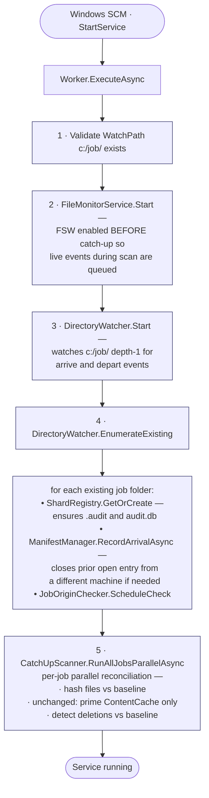

The startup order changed from the original design: **FSW is enabled before** the catch-up scan runs, so live events that fire during the scan are buffered into the channel and processed by consumer tasks while CatchUp also runs. The `_recentlyDeparted` guard in `ShardRegistry.GetOrCreate` is irrelevant at startup — no jobs have departed yet.

---

## A.4 — Live File Change Event Flow (lazy queue model)

```mermaid
sequenceDiagram
    autonumber
    actor User as RMS_AOI
    participant FS as NTFS
    participant Mon as FileMonitorService
    participant Ch as Channel
    participant H as FileChangeHandler
    participant Q as AuditEventQueue
    participant DB as auditdb

    User->>FS: write Recipe.ini
    FS->>Mon: FSW Changed event
    Note over Mon: arm 500 ms debounce timer
    User->>FS: Flush and close
    FS->>Mon: FSW Changed event
    Note over Mon: timer resets;<br/>_latestEvent[path] = ev
    Note over Mon: 500 ms quiet window
    Mon->>Ch: WriteAsync ChangeEvent —<br/>bounded 1024
    Ch->>H: ConsumeAsync dequeues
    Note over H: skip if path contains .audit<br/>GetOrCreate — refused if _recentlyDeparted<br/>Classify · Hash · GetBaselineAsync<br/>if P1: read content and DiffPlex
    H->>Q: EnqueueAsync entry baseline
    Note over Q: append to in-memory buffer<br/>arm 1 s timer if first event<br/>or flush now if cap hit
    Note over Q: flush trigger, any one of:<br/>• timer fires at 1 s<br/>• buffer reaches FlushQueueMax<br/>• FlushAsync called<br/>• job departs — Discard<br/>• service shutdown
    Q->>Q: IsJobFolderEmptyOfUserContent? — if yes, drop batch
    Q->>DB: WriteBatchAsync — open BEGIN INSERTxN UPSERTxN COMMIT close
    Q->>FS: ManifestManager.IncrementEventsByAsync
```

**Latency budget:** ~500 ms debounce + ~10 ms classify/hash + up to 1 s queue dwell. Worst case file-close → audit.db row: ~1.5 s. P1 files with content + diff dominate the per-event cost; batching amortises the SQLite transaction overhead across many events.

---

## A.5 — Job Portability Flow (Option C — Cut & Paste between machines)

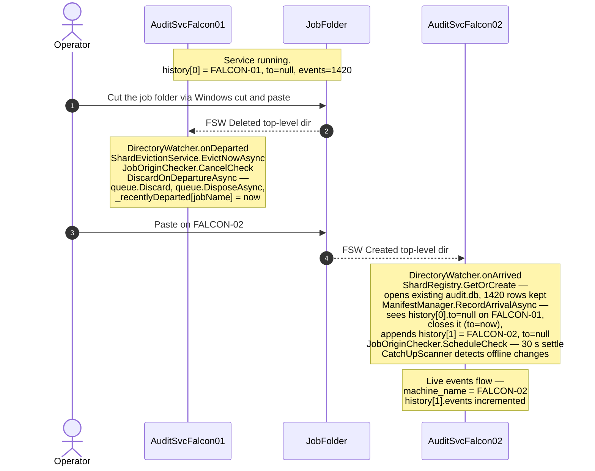

**Notes**

- No symmetric "departure write" is made on FALCON-01. The previous entry is closed *lazily* on the destination machine when `RecordArrivalAsync` sees a different machine's `to: null`. This eliminated a write-then-delete in the local-delete path (see A.7).
- For a local delete (not a move), the entire `.audit\` is destroyed along with the job — no departure record is meaningful.

---

## A.6 — New Job Arrival Flow (Live, while service is running)

Triggered by Save-As, drag-paste, or any other new top-level folder under `c:\job\`.

```mermaid
sequenceDiagram
    autonumber
    actor Op as Operator
    participant FS as NTFS
    participant DW as DirectoryWatcher
    participant SR as ShardRegistry
    participant MM as ManifestManager
    participant JOC as JobOriginChecker
    participant CUS as CatchUpScanner

    Op->>FS: Create or paste c:/job/NewJob/
    FS->>DW: FSW Created — depth-1 dir
    DW->>SR: GetOrCreate NewJob, path
    Note over SR: mkdir .audit Hidden<br/>SqliteRepository wraps audit.db, lazy Pooling=False<br/>AuditEventQueue created, in-memory only
    DW->>MM: RecordArrivalAsync path, machineName
    Note over MM: write manifest.json<br/>history[0] = from now, to null
    DW->>JOC: ScheduleCheck NewJob
    Note over JOC: 30 s settle, then classify —<br/>NewLocal or CopiedFromRemote
    Op->>FS: Save-As copies many files
    FS-->>SR: FSW Created, per file
    Note over SR: events flow Channel → ConsumeAsync → HandleAsync<br/>→ EnqueueAsync → AuditEventQueue<br/>→ batched flush to audit.db<br/>FileEra = JobInit until settle window closes;<br/>flips to Runtime thereafter
```

---

## A.7 — Job Delete Flow (no synchronous API call)

> **Deep dive:** see `appendix_F_job_deletion.md` for full design, defense layers, edge cases, and configuration.

Triggered by `Falcon.Net frmJobTab.DeleteJobOrSetup` or `DeleteAllJobsExcept`. **No HTTP call to the audit service** — Falcon just does its recursive `Directory.Delete`. The audit service learns about the departure via FSW only.

```mermaid
sequenceDiagram
    autonumber
    actor Op as Operator
    participant F as FalconAOI
    participant FS as NTFS
    participant Mon as FileMonitorService
    participant H as FileChangeHandler
    participant DB as auditdb
    participant DW as DirectoryWatcher
    participant Ev as ShardEvictionService
    participant SR as ShardRegistry

    Op->>F: Click Delete then Confirm
    Note over F: TryDeleteJob HTTP call was removed —<br/>no audit-side prep
    F->>FS: Directory.Delete jobPath recursive=true

    loop for each file in walk
        FS-->>Mon: FSW Deleted file
        Mon->>H: ConsumeAsync → HandleAsync
        Note over H: skip if .audit path
        H->>DB: GetBaselineAsync opens audit.db
        Note over DB: audit.db may be<br/>deleted by the walk<br/>during this window
        DB--xH: SqliteException 14 SQLITE_CANTOPEN
        Note over Mon: caught at ConsumeAsync<br/>LogDebug and drop event —<br/>job is going away anyway
    end

    Note over FS: walk completes;<br/>job folder removed
    FS-->>DW: FSW Deleted top-level dir
    DW->>Ev: EvictNowAsync reason=folder departed
    Ev->>SR: JobOriginChecker.CancelCheck
    Ev->>SR: DiscardOnDepartureAsync jobName
    Note over SR: queue.Discard<br/>queue.DisposeAsync awaits in-flight flush<br/>_recentlyDeparted[jobName] = now
    Note over Ev: TryDeleteAuditFolder, TryDeleteJobFolderIfEmpty —<br/>both no-op, folder already gone
    Note over SR: 10 s guard window — late FSW events for<br/>this jobName hit GetOrCreate and are refused
```

**Defense layers protecting Falcon's recursive delete from racing the audit service:**

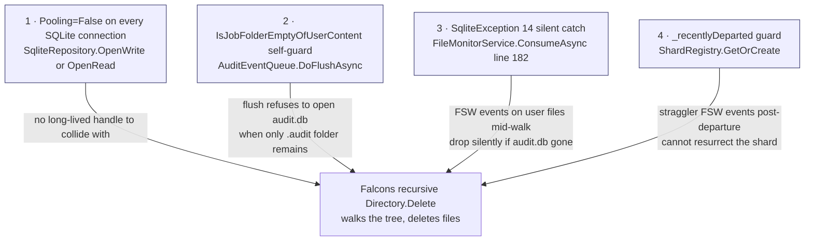

---

## A.8 — CatchUpScanner Flow (Per-Job Scope)

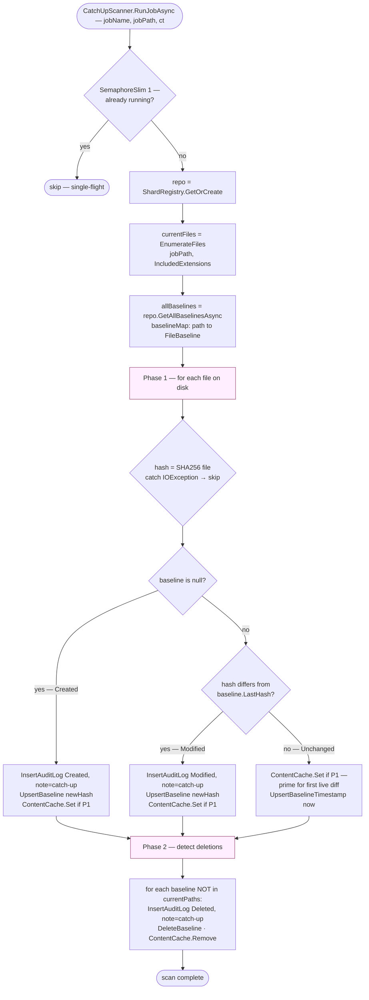

`FileEra` rules apply: the *first* CatchUp on a brand-new shard records `JobInit`; subsequent CatchUps (after FSW overflow, on restart) record `Runtime`. See `appendix_E_job_origin_detection.md` for the full era classification.

---

## A.9 — FileClassifier Hot-Reload Flow

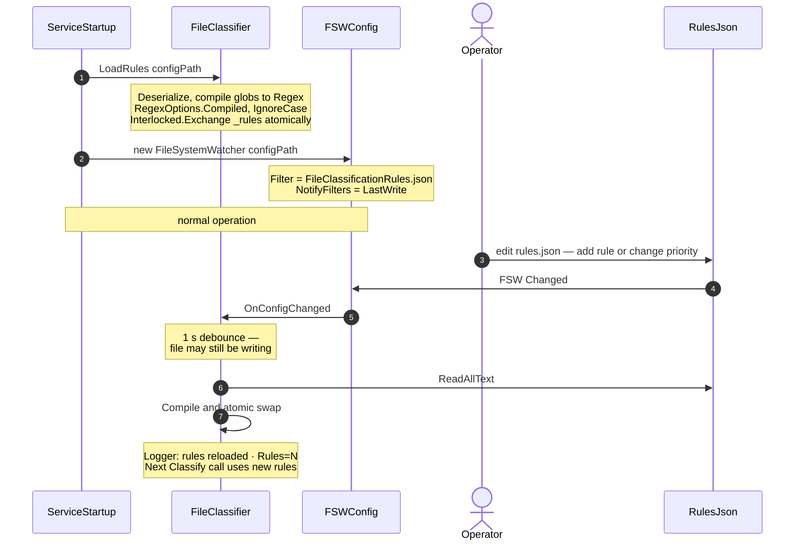

No service restart, no event loss — in-flight events use whichever ruleset was current when they entered `Classify()`.

---

## A.10 — FSW Buffer Overflow Recovery Flow

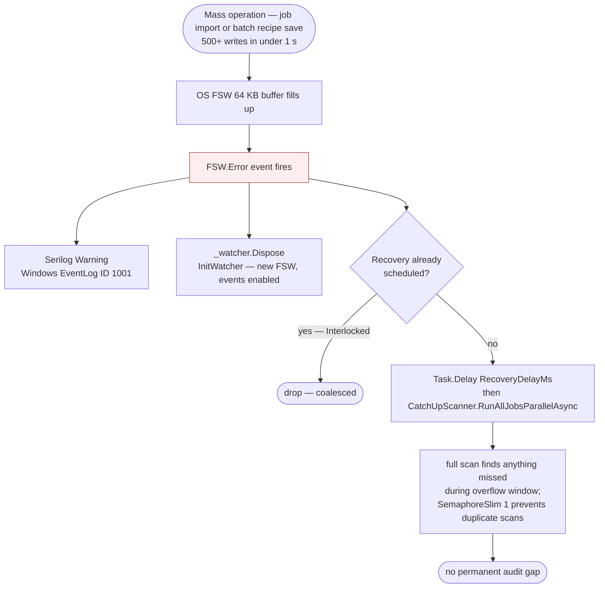

---

## A.11 — Storage & Write-Safety Model (lazy connections + per-job queue)

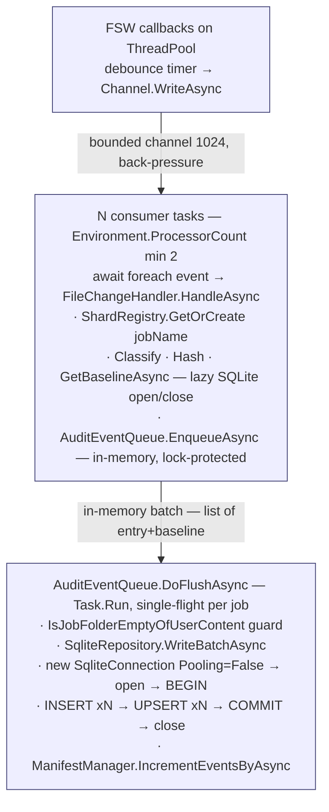

**SQLite connection lifecycle:**

- No long-lived handle anywhere. Every operation (`WriteBatchAsync`, `GetBaselineAsync`, `ListJobsAsync`, `GetEventsAsync`) opens, uses, and closes its own `SqliteConnection`.
- `Pooling=False` on the connection string forces immediate native-handle release on `Dispose()`, so `audit.db` has no lingering OS lock between operations — Falcon's recursive `Directory.Delete` cannot collide with a stale handle.
- WAL mode: readers never block writers, writer never blocks readers.
- Single-flight per `AuditEventQueue`: `_inFlightFlush` coalesces overlapping flush requests onto one Task.

**Per-job state held in memory:**

| Class | Field | Type | Notes |
|---|---|---|---|
| `AuditEventQueue` | `_buffer` | `List<(AuditLogEntry, FileBaseline)>` | lock-guarded |
| `AuditEventQueue` | `_pendingManifestBumps` | `int` | lock-guarded |
| `AuditEventQueue` | `_timer` | `Timer?` | 1 s flush timer (first-event anchored) |
| `AuditEventQueue` | `_inFlightFlush` | `Task?` | flush coalescing |
| `ShardRegistry` | `_queues` | `ConcurrentDictionary<jobName, AuditEventQueue>` | one queue per job |
| `ShardRegistry` | `_recentlyDeparted` | `ConcurrentDictionary<jobName, DateTime>` | 10 s resurrection guard |

---

## A.12 — Manifest.json State Machine

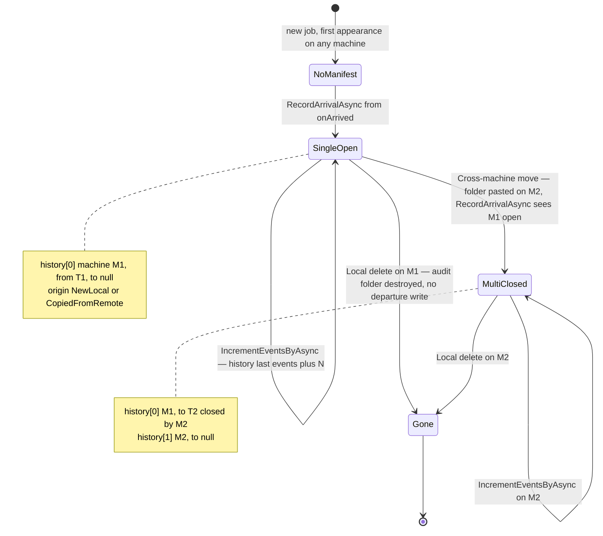

**Write safety:** all manifest writes go to `manifest.json.tmp`, then `File.Move(tmp, manifest.json, overwrite:true)` — atomic on NTFS.

**No symmetric departure write.** The previous machine's entry is closed *on arrival* at the destination, not on departure from the source. The 2026-05-12 redundancy audit dropped the local-delete `RecordDepartureAsync` call — it was a write-then-delete (manifest gone immediately afterwards).

---

## A.13 — Component Dependency Graph

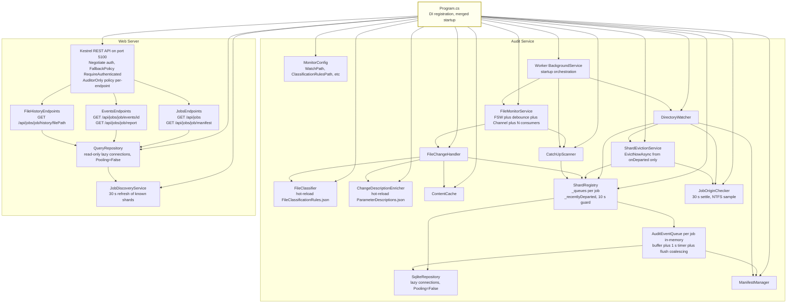

**Key changes vs. original design:**
- `AuditEventQueue` is a new per-job in-memory component owned by `ShardRegistry`. It batches FSW events between FSW callback and `audit.db` write.
- `ShardEvictionService` is a new component invoked **only** from `DirectoryWatcher.onDeparted` — there is no API endpoint for delete (the `MapDelete` was removed in the 2026-05-12 redundancy audit).
- `JobOriginChecker` schedules a 30 s settle window per arriving job to classify origin (see Appendix E).
- `QueryRepository` no longer caches read connections in a `ConcurrentDictionary` — every read opens and closes its own connection (`Pooling=False`).

---

## A.14 — Project File Structure

Single exe — `FalconAuditWebServer` project hosts both the audit service and the REST API.

```
FalconAuditWebServer/                   ← single project (assembly: FalconAuditService.exe)
├── FalconAuditWebServer.csproj         ← SDK: Microsoft.NET.Sdk.Web
│                                          AssemblyName: FalconAuditService
│                                          Packages: Sqlite · Negotiate · WindowsServices
│                                                    DiffPlex · Serilog (File+EventLog)
├── Program.cs                          ← merged startup: service DI + web DI +
│                                          UseWindowsService() + Kestrel endpoints
├── appsettings.json                    ← unified config: AuditService: · Kestrel: · Serilog:
│
├─── AUDIT SERVICE ──────────────────────────────────────────────────────────
├── Worker.cs                           namespace FalconAuditService
├── ChangeEvent.cs                      namespace FalconAuditService
├── ContentCache.cs                     namespace FalconAuditService
├── FileMonitorService.cs               namespace FalconAuditService  ← SqliteException(14) catch
├── FileChangeHandler.cs                namespace FalconAuditService
├── FileClassifier.cs                   namespace FalconAuditService
├── ChangeDescriptionEnricher.cs        namespace FalconAuditService
├── HashHelper.cs                       namespace FalconAuditService
├── DiffHelper.cs                       namespace FalconAuditService
├── SqliteRepository.cs                 namespace FalconAuditService  ← lazy, Pooling=False
├── ShardRegistry.cs                    namespace FalconAuditService  ← _recentlyDeparted guard
├── AuditEventQueue.cs                  namespace FalconAuditService  ← per-job buffer + flush
├── ShardEvictionService.cs             namespace FalconAuditService  ← onDeparted handler only
├── ManifestManager.cs                  namespace FalconAuditService
├── DirectoryWatcher.cs                 namespace FalconAuditService
├── CatchUpScanner.cs                   namespace FalconAuditService
├── JobOriginChecker.cs                 namespace FalconAuditService  ← see Appendix E
├── LoginReader.cs                      namespace FalconAuditService
├── Models/
│   ├── AuditLogEntry.cs               namespace FalconAuditService.Models
│   ├── FileBaseline.cs                namespace FalconAuditService.Models
│   ├── MonitorConfig.cs               namespace FalconAuditService.Models
│   └── JobManifest.cs                 namespace FalconAuditService.Models
│
├─── WEB SERVER ─────────────────────────────────────────────────────────────
├── Endpoints/
│   ├── JobsEndpoints.cs               namespace FalconAuditWebServer.Endpoints
│   ├── EventsEndpoints.cs             namespace FalconAuditWebServer.Endpoints
│   └── FileHistoryEndpoints.cs        namespace FalconAuditWebServer.Endpoints
├── Services/
│   ├── JobDiscoveryService.cs         namespace FalconAuditWebServer.Services
│   └── QueryRepository.cs             namespace FalconAuditWebServer.Services
├── Models/
│   ├── AuditEventSummary.cs           namespace FalconAuditWebServer.Models
│   ├── AuditEventDetail.cs            namespace FalconAuditWebServer.Models
│   ├── EventFilter.cs                 namespace FalconAuditWebServer.Models
│   ├── JobSummary.cs                  namespace FalconAuditWebServer.Models
│   └── FileHistoryItem.cs             namespace FalconAuditWebServer.Models
│
├─── CONFIG (deployed alongside exe) ───────────────────────────────────────
├── FileClassificationRules.json        ← 69 glob rules (hot-reload)
└── ParameterDescriptions.json          ← INI key → human label (hot-reload)
```

---

## A.15 — REST API Detail

### A.15.1 — Authentication & Authorisation

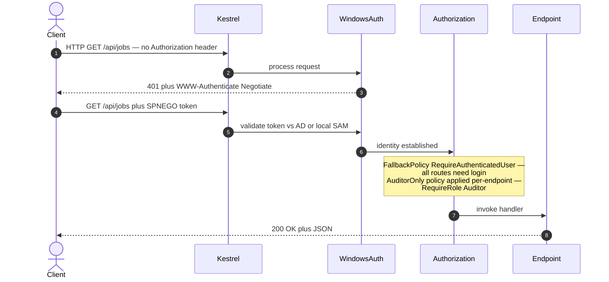

### A.15.2 — Endpoint Reference

```
GET /api/jobs
  Response: [ JobSummary ]  → jobName, shardPath, totalEvents,
                              firstEvent, lastEvent, machines,
                              shardSizeBytes, origin
  Source:   QueryRepository.ListJobsAsync
            → reads audit_log COUNT, MIN/MAX changed_at,
              GROUP_CONCAT(machine_name) per shard
              (lazy connection, Pooling=False)

GET /api/jobs/{jobName}/manifest
  Response: manifest.json contents as JSON
  Source:   FlushAsync the queue first, then reads
            .audit\manifest.json directly

GET /api/jobs/{jobName}/events
  Query params (all optional):
    module · priority · service · eventType · machine
    from · to · path · fileEra · excludeCreated
    sort=asc|desc      page · pageSize
  Response: { items: [ AuditEventSummary ], total: N, page, pageSize }
  Source:   QueryRepository.GetEventsAsync
            → parameterised SQL with dynamic WHERE

GET /api/jobs/{jobName}/events/{id:long}
  Response: AuditEventDetail (includes old_content, diff_text)
  Source:   QueryRepository.GetEventAsync
  Auth:     RequireAuthorization("AuditorOnly")  ← only this endpoint opts in

GET /api/jobs/{jobName}/report?format=json|csv&from=...&to=...
  Response: JSON {Job, From, To, Total, GeneratedAt, Items} or CSV
  Source:   QueryRepository.GetEventsAsync filtered to FileEra="Runtime"
            (excludes JobInit unless from-date is before job creation)

GET /api/jobs/{jobName}/history/{*filePath}
  Response: [ FileHistoryItem ] ordered by changed_at ASC
  Source:   QueryRepository.GetFileHistoryAsync
            → WHERE rel_filepath = @p
            (path traversal guard: filePath must resolve inside jobRoot)

(No DELETE endpoint — eviction is FSW-driven; see Appendix F.)
```

### A.15.3 — Query Request Flow

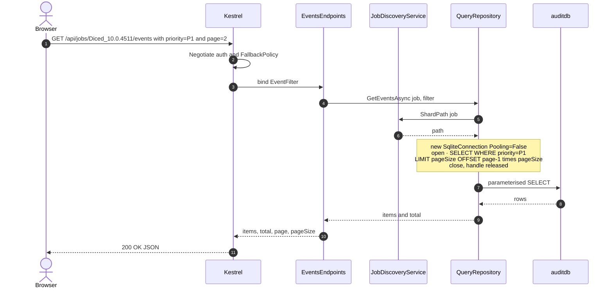

### A.15.4 — JobDiscoveryService Refresh Cycle

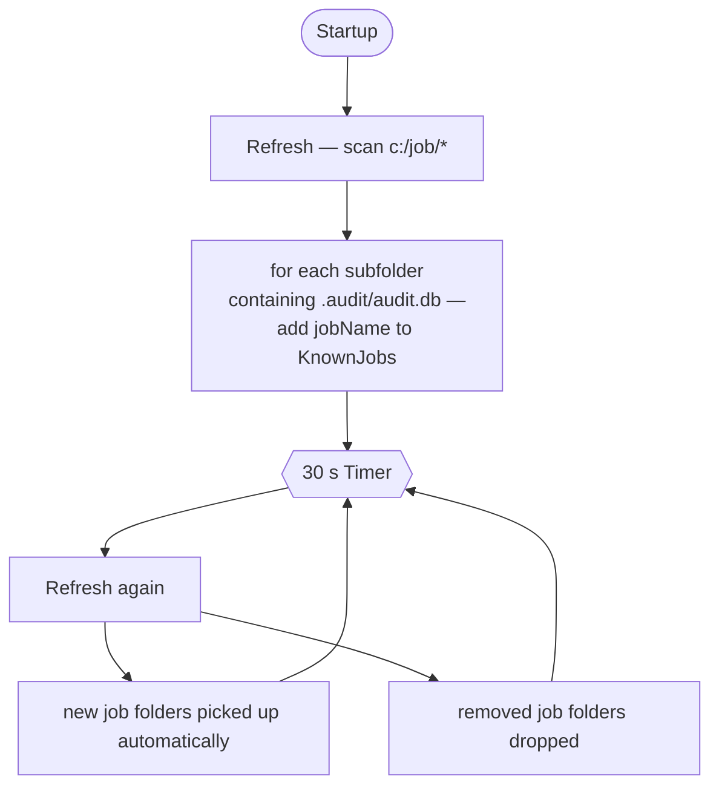

The audit service and web server share the same process — `KnownJobs` tracks the same shards the service is writing to. No inter-process coordination needed.
