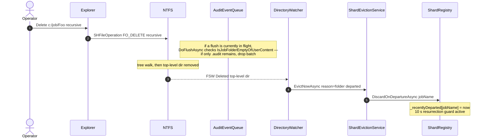
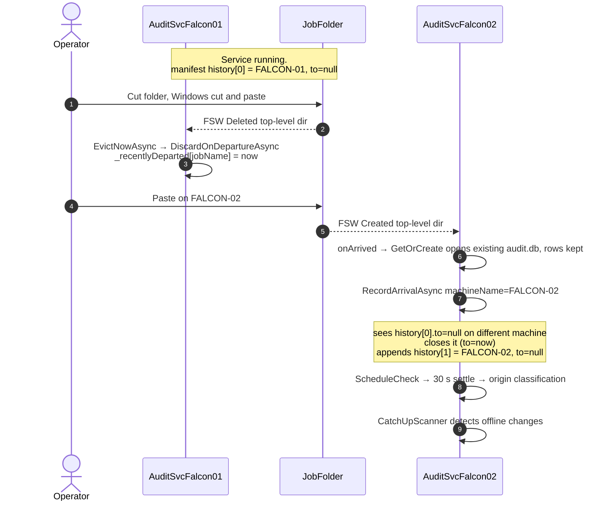
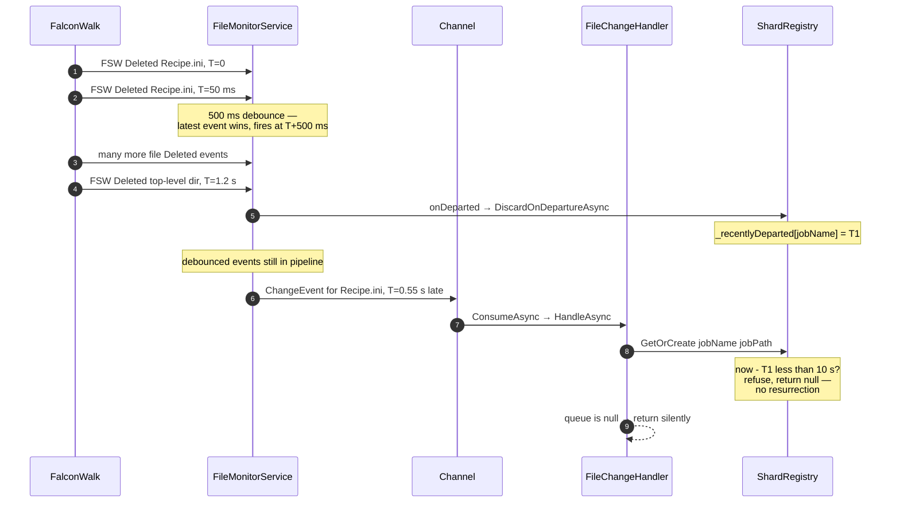
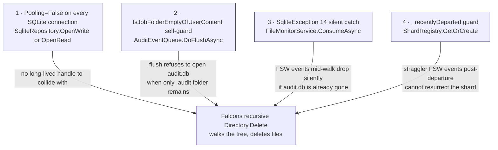

# Appendix F — Job Deletion Design

## Purpose

Specify how `FalconAuditService` coexists with Falcon's recursive `Directory.Delete` of a job folder, so that:

| Guarantee | What it prevents |
|---|---|
| No long-lived SQLite handle on `audit.db` | Falcon's `Directory.Delete` cannot hit `IOException` from a held audit-DB file lock |
| Eviction is FSW-driven only (no HTTP call) | Decouples Falcon's UI thread from the audit service; no Negotiate handshake on the delete path |
| Mid-walk FSW events do not resurrect the shard | Prevents a fresh `.audit\` from being created behind Falcon's walk and leaving a husk |
| `.audit\` is never treated as a job setup | Prevents the JobSelect dialog from picking `.audit` as the implicit `SelectedSetup` and breaking the next Open-Job |

The design is **BIS-independent** on the eviction side (it relies only on Falcon doing a standard recursive `Directory.Delete`), with a small symmetric requirement on the BIS side: any setup-folder enumeration must filter `.audit\`.

---

## Flow Diagrams

### Flow 1 — Local Delete from Falcon UI

Triggered by `Falcon.Net.Forms.frmJobTab.DeleteJobOrSetup` or `DeleteAllJobsExcept`. There is **no synchronous HTTP call** to the audit service — Falcon just does its recursive `Directory.Delete`. The audit service learns about the departure via FSW only.

```mermaid
sequenceDiagram
    autonumber
    actor Op as Operator
    participant F as FalconAOI
    participant FS as NTFS
    participant Mon as FileMonitorService
    participant H as FileChangeHandler
    participant DB as auditdb
    participant DW as DirectoryWatcher
    participant Ev as ShardEvictionService
    participant SR as ShardRegistry

    Op->>F: Click Delete, Confirm Yes
    Note over F: TryDeleteJob HTTP call was<br/>removed — no audit-side prep
    F->>FS: Directory.Delete jobPath recursive=true

    loop while walking job tree
        FS-->>Mon: FSW Deleted file
        Mon->>H: ConsumeAsync → HandleAsync
        Note over H: skip if path contains .audit<br/>else GetBaselineAsync opens audit.db
        H->>DB: open audit.db
        alt audit.db not yet deleted
            DB-->>H: baseline row or null
            Note over H: event dropped — entry's job<br/>is going away, flush will be a no-op
        else audit.db deleted by walk
            DB--xH: SqliteException 14 SQLITE_CANTOPEN
            Note over Mon: caught at ConsumeAsync<br/>LogDebug and drop event
        end
    end

    Note over FS: walk complete; job folder removed
    FS-->>DW: FSW Deleted top-level dir
    DW->>Ev: EvictNowAsync reason=folder departed
    Ev->>SR: JobOriginChecker.CancelCheck
    Ev->>SR: DiscardOnDepartureAsync jobName
    Note over SR: queue.Discard<br/>queue.DisposeAsync awaits in-flight flush<br/>_recentlyDeparted[jobName] = now
    Note over Ev: TryDeleteAuditFolder and TryDeleteJobFolderIfEmpty<br/>both no-op — folder already gone
    Note over SR: 10 s guard window —<br/>late FSW events for this jobName<br/>hit GetOrCreate and are refused
```

---

### Flow 2 — Manual Delete (operator removes folder in Explorer)

Same as Flow 1 but with no Falcon orchestration. The audit service is the only observer of the event.



The `IsJobFolderEmptyOfUserContent` self-guard in `AuditEventQueue.DoFlushAsync` is what makes this safe — it inspects the job folder at flush time and bails if only `.audit\` remains.

---

### Flow 3 — Cross-Machine Departure (cut & paste between machines)

The job folder is moved to another machine while both services run. There is no synchronous "departure write" — the *destination* machine closes the previous entry lazily when arrival sees `to: null` from a different machine name.



---

### Flow 4 — Resurrection Guard Timing

This is the timeline that prevents a stale FSW event from resurrecting a shard for a just-departed job. The guard window must be **longer** than the worst-case debounce + queue dwell so any in-flight event for the departing job finds the guard set when it reaches `GetOrCreate`.



**Guard window must satisfy:**
`_resurrectionGuardWindow ≥ DebounceMs + max(queue dwell) + safety margin`

Current config: `DebounceMs = 500 ms`, queue can dwell up to `FlushIntervalSeconds = 1 s` between enqueue and flush. The 10 s window is comfortably ahead of that.

---

## Defense Layers

Four independent layers protect Falcon's recursive delete from racing the audit service. Any *one* of them is sufficient for the common case; together they make the failure mode impossible to observe under normal load.



| # | Layer | Protects | Location |
|---|---|---|---|
| 1 | `Pooling=False` | No long-lived audit.db file lock that could block `Directory.Delete` | `SqliteRepository.cs` — every connection string |
| 2 | `IsJobFolderEmptyOfUserContent` self-guard | Flush refuses to open audit.db when only `.audit\` remains (late phase of recursive delete) | `AuditEventQueue.DoFlushAsync` |
| 3 | `SqliteException(14)` silent catch | FSW events on user files arriving *after* audit.db was deleted (mid phase) are logged at Debug and dropped — no Error noise | `FileMonitorService.ConsumeAsync` |
| 4 | `_recentlyDeparted` resurrection guard | After `DiscardOnDepartureAsync` fires, `GetOrCreate` refuses to recreate the shard for ~10 s, preventing a fresh `.audit\` from being created behind Falcon's walk | `ShardRegistry.GetOrCreate` and `DiscardOnDepartureAsync` |

---

## Component Design

### `ShardEvictionService.EvictNowAsync`

Single entry point for the audit service to react to a job's departure. Invoked only from `DirectoryWatcher.onDeparted` (no API endpoint).

```csharp
public async Task EvictNowAsync(string jobName, string jobPath, string reason)
{
    try
    {
        _origin.CancelCheck(jobName);                       // cancel pending settle timer
        await _shards.DiscardOnDepartureAsync(jobName);     // drains queue, sets _recentlyDeparted
        TryDeleteAuditFolder(jobName, jobPath);             // no-op if .audit\ already gone
        TryDeleteJobFolderIfEmpty(jobName, jobPath);        // no-op if job folder already gone
        _logger.LogInformation("ShardEvictionService: evicted '{J}' ({R}).", jobName, reason);
    }
    catch (Exception ex) { _logger.LogError(ex, ...); }
}
```

`RecordDepartureAsync` (manifest write) used to live in this method between `DiscardOnDepartureAsync` and `TryDeleteAuditFolder`. It was dropped in the 2026-05-12 redundancy audit: the record was written then destroyed two lines later by the `.audit\` cleanup. No consumer read it. The cross-machine portability case (Flow 3) closes the previous entry on the *destination* machine instead — see `ManifestManager.RecordArrivalAsync`.

### `ShardRegistry.DiscardOnDepartureAsync`

```csharp
public async Task DiscardOnDepartureAsync(string jobName)
{
    if (_queues.TryRemove(jobName, out var queue))
    {
        queue.Discard();                                    // drop in-memory buffer
        await queue.DisposeAsync();                         // awaits any in-flight flush
        _recentlyDeparted[jobName] = DateTime.UtcNow;       // arm resurrection guard
        _logger.LogInformation("ShardRegistry: discarded queue for departed job '{J}'.", jobName);
    }
    else
    {
        _recentlyDeparted[jobName] = DateTime.UtcNow;       // still arm guard for jobs we never queued
    }
}
```

### `ShardRegistry.GetOrCreate` — resurrection guard

```csharp
public AuditEventQueue? GetOrCreate(string jobName, string jobPath)
{
    if (_queues.TryGetValue(jobName, out var existing)) return existing;
    if (!Directory.Exists(jobPath)) return null;

    var now = DateTime.UtcNow;
    if (_recentlyDeparted.TryGetValue(jobName, out var departedAt) &&
        now - departedAt < _resurrectionGuardWindow)
    {
        _logger.LogDebug("ShardRegistry: refusing GetOrCreate for '{J}' — recently departed.", jobName);
        return null;
    }

    // Opportunistic prune of stale entries
    foreach (var kv in _recentlyDeparted)
        if (now - kv.Value > TimeSpan.FromMinutes(5))
            _recentlyDeparted.TryRemove(kv.Key, out _);

    // ... existing creation logic ...
}
```

### `AuditEventQueue.DoFlushAsync` — self-guard

```csharp
private async Task DoFlushAsync(...)
{
    if (IsJobFolderEmptyOfUserContent())     // only .audit\ remains?
    {
        Discard();                            // drop the buffered events
        _logger.LogInformation("AuditEventQueue '{J}': job folder content gone — skipping flush.", _jobName);
        return;
    }
    await _repo.WriteBatchAsync(batch);
    await _manifest.IncrementEventsByAsync(_jobPath, bumps);
}
```

### `FileMonitorService.ConsumeAsync` — Sqlite14 catch

```csharp
try { await _handler.HandleAsync(ev); }
catch (SqliteException sx) when (sx.SqliteErrorCode == 14)
{
    // SQLITE_CANTOPEN: audit.db is gone because Falcon's recursive
    // Directory.Delete removed .audit\ before this FSW event for a
    // sibling user file finished processing. Expected during job deletes.
    _logger.LogDebug("Skipping event for departing job (audit.db gone). Path={P}", ev.FullPath);
}
catch (Exception ex) { _logger.LogError(ex, "Error processing event. Path={P}", ev.FullPath); }
```

---

## BIS-Side Requirement: `.audit\` filter on setup enumeration

The audit service creates a hidden `.audit\` subfolder inside every job. Any BIS code path that enumerates a job's immediate subfolders treats them as **setup names** by convention — so if `.audit\` is included in that enumeration, BIS will treat it as a setup and the next "Open Job" can silently misbehave.

| File | Location | Filter |
|---|---|---|
| `frmJSMain.cs` | `apps\JobSelect.Net\` line ~656 | JobSelect dialog `LayerView` population — filter `.audit\` before `Items.Add` |
| `MainContextModule.cs` | `apps\Falcon.Net\MainContext\` line ~2179 (`GetFirstFolder`) | Falcon's fallback "first setup folder" lookup used by `CheckLoadJob` |
| `frmJobTab.cs` | `apps\Falcon.Net\Forms\` line ~3609 (`isJobDeletion` count) | Existing filter — the pattern was first established here |

The filter is a name match against `.audit` (`OrdinalIgnoreCase`). Any future setup enumeration of a job's subfolders MUST apply the same filter — see the diagnostic signature below.

**Diagnostic signature when the filter is missing**: BIS log shows `frmJSMain::OpenJob Enter: Job=<picked>` with **no** subsequent `LoadSetup ===>>> Enter` for that path. `CheckLoadJob` returns false at line 3799 because `<job>\.audit\Recipes\` doesn't exist. UI ends up with no job loaded.

---

## Configuration

| Key | Default | Where | Meaning |
|---|---|---|---|
| `_resurrectionGuardWindow` | `10 s` | `ShardRegistry.cs` (constant) | How long after `DiscardOnDepartureAsync` `GetOrCreate` refuses to resurrect a shard for the same job name |
| `DebounceMs` | `500 ms` | `MonitorConfig` | FSW debounce window (per file) |
| `FlushIntervalSeconds` | `1 s` | `MonitorConfig` | Per-job AuditEventQueue flush timer (anchored on first event in batch) |
| `FlushQueueMax` | `200` | `MonitorConfig` | Per-job queue size cap that triggers immediate flush |
| `JobSettleTimeSeconds` | `30 s` | `MonitorConfig` | JobOriginChecker settle window — also the upper bound on the "cancel pending origin check" window during eviction |

The resurrection-guard window MUST exceed `DebounceMs + FlushIntervalSeconds + safety margin`. The 10 s default sits comfortably above the worst-case ~1.5 s pipeline dwell.

---

## Files Changed

### Round 1 — 2026-05-07 (Falcon "Busy..." hang)

| File | Type | Purpose |
|---|---|---|
| `DataAccess\DataLayer\Implementations\ReferencesInfo.cs` (BIS) | Modified | `Load()` `Save(path)` fallback now guards on `Directory.Exists(Path.GetDirectoryName(path))` |
| `ShardRegistry.cs` | Modified | `DiscardOnDeparture` renamed to `DiscardOnDepartureAsync`; awaits `queue.DisposeAsync()` |
| `ShardEvictionService.cs` | Modified | `EvictNowAsync` awaits `DiscardOnDepartureAsync` |

### Round 2 — 2026-05-12 (Open-Job-after-delete leaves UI empty)

| File | Type | Purpose |
|---|---|---|
| `apps\JobSelect.Net\frmJSMain.cs` (BIS) | Modified | Setup-list `foreach` filters `.audit\`; guard `Items[0].Focused` behind `Items.Count > 0` |
| `apps\Falcon.Net\MainContext\MainContextModule.cs` (BIS) | Modified | `GetFirstFolder` filters `.audit\` |

### Round 3 — 2026-05-12 (redundancy audit + resurrection fix + noise silence)

| File | Type | Purpose |
|---|---|---|
| `ShardRegistry.cs` | Modified | Added `_recentlyDeparted` dictionary and `_resurrectionGuardWindow`; gate added in `GetOrCreate`; timestamp recorded in `DiscardOnDepartureAsync` |
| `ShardEvictionService.cs` | Modified | Removed orphaned `RecordDepartureAsync` call (write-then-delete) |
| `Endpoints\JobsEndpoints.cs` | Modified | Removed `MapDelete("/jobs/{jobName}")` |
| `Program.cs` (audit svc) | Modified | Restored `FallbackPolicy = RequireAuthenticatedUser` (was over-broadly removed) |
| `FileMonitorService.cs` | Modified | Added `SqliteException(14)` catch in `ConsumeAsync`; logs at Debug |
| `apps\Falcon.Net\Modules\FalconAudit\FalconAuditClient.cs` (BIS) | Modified | Removed `TryDeleteJob` and `WarmUpAuth` methods |
| `apps\Falcon.Net\Program.cs` (BIS) | Modified | Removed `WarmUpAuth()` startup call |
| `apps\Falcon.Net\Forms\frmJobTab.cs` (BIS) | Modified | Removed `TryDeleteJob` calls in `DeleteAllJobsExcept` (line ~440) and `DeleteJobOrSetup` (line ~3628) |

---

## Edge Cases

| Scenario | Defense layers in play | Outcome |
|---|---|---|
| Normal Save-As → wait → Delete → Open another | (4) guard window covers minimal stragglers | Clean ✓ |
| Save-As → immediate Delete (~1 s gap) | (3) Sqlite14 catch + (4) guard window | Clean — no husk, no Error noise ✓ |
| Manual delete in Explorer | (2) `IsJobFolderEmptyOfUserContent` + (3) Sqlite14 + (4) guard | Clean ✓ |
| Audit service restart mid-delete | Folder still goes away; on restart `EnumerateExisting` does not see it; `onArrived` not called | Clean ✓ |
| In-flight flush at delete time | (2) self-guard if folder is "empty of user content"; otherwise flush completes, releases handle, walk proceeds | Clean ✓ |
| Many parallel deletes of different jobs | `_recentlyDeparted` is per-job-name; queues are per-job | Clean ✓ |
| `.audit\` accidentally part of BIS setup enumeration | A new code path treats `.audit` as a setup name → CheckLoadJob fails → next Open Job is broken | **Regression** — add the same `.audit\` filter (see BIS-Side Requirement) |
| Rapid Delete → Save-As-with-same-name within 10 s | `_recentlyDeparted` blocks new shard → `GetOrCreate` returns null → events for new files are dropped silently | **Acceptable** — the 10 s guard is small and the chance of name reuse is low. Operator can rename or wait. |
| Falcon's recursive delete partially fails | `.audit\` may survive as a husk. On next restart `EnumerateExisting` sees it and opens the shard normally; CatchUp reconciles | Recoverable ✓ |

---

## Verification

1. **Scenario B (regression — Round 2 fix):** Open existing job → Save-As → wait a few seconds → Delete → Open *different* existing job. BIS log must show `LoadSetup ===>>> Enter - c:\job\<picked>\<setup>\` after the user picks the new job. UI shows the new job.
2. **Scenario B-fast (race — Round 3 fix):** Same as B but Delete *immediately* after Save-As completes (~1 s gap). Audit log must have **zero** `[ERR] FileMonitorService Error processing event` lines and **zero** `ShardRegistry: opening shard for job '<deleted-name>'` lines between the eviction and the DirectoryWatcher `job folder departed` entry.
3. **Husk regression:** After repeated Save-As → rapid-Delete cycles, audit `C:\job` for any `<deleted-name>\` folders containing only `.audit\`. Detection: `Get-ChildItem "C:\job" -Directory -Force | Where-Object { (Get-ChildItem $_.FullName -Force | Where-Object Name -ne '.audit').Count -eq 0 }`. Should be empty.
4. **Auth posture (Round 3 revert of `FallbackPolicy`):** `Invoke-WebRequest -Uri http://127.0.0.1:5100/api/jobs` anonymously → **401**. With `-UseDefaultCredentials` → 200. No DELETE endpoint exists.
5. **No `WarmUpAuth` at AOI startup:** Audit log should show no `Request starting HTTP/1.1 GET http://localhost:5100/api/jobs` from AOI launch (the warm-up call was removed).
6. **Cross-machine portability (Flow 3):** Cut a job folder from machine A while audit service runs, paste on machine B with audit service running. Open `.audit\manifest.json` — `history[]` should show TWO entries (FALCON-01 closed by FALCON-02 on arrival, FALCON-02 still open).
